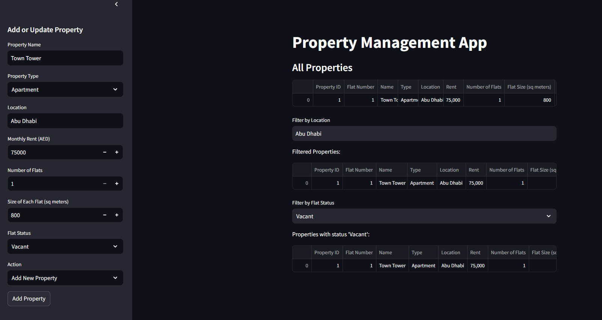

# Property Management App

A web-based **Property Management App** built using **Python**, **Streamlit**, **ML** allowing users to manage property data efficiently. The app supports adding, updating, deleting, and filtering property details such as names, types, locations, rent prices, and flat statuses. All data is stored in a **CSV file** for easy management.

## 📷 Screenshot  

## Features

- **Add New Property**: Enter property details such as name, type, location, rent, and flat information. Data is stored in a CSV file.  
- **Update Existing Property**: Modify details of an existing property using its **Property ID** and **Flat Number**.  
- **Delete Property**: Remove a property and flat using **Property ID** and **Flat Number**.  
- **Filter Properties**: Search properties by **location** or **flat status** (Vacant/In Use).  
- **Data Storage**: All property data is **persistently stored** in a CSV file for easy retrieval and updates.  

## 🚀 Usage

1. Open the app in a web browser.
2. Use the **sidebar** to:
   - **Add** a new property.  
   - **Update** existing property details.  
   - **Delete** a property entry.  
   - **Filter** properties by location or flat status.  

---

## 🛠 Built With  
- **Streamlit** – For the user interface and interactive components.  
- **Python**, **Pandas** , **ML**– For managing and manipulating property data.  
- **CSV** – Used as the primary data storage format.  

👨‍💻 **Developer**: Aneesh Mohanan
📌 **License**: MIT  
